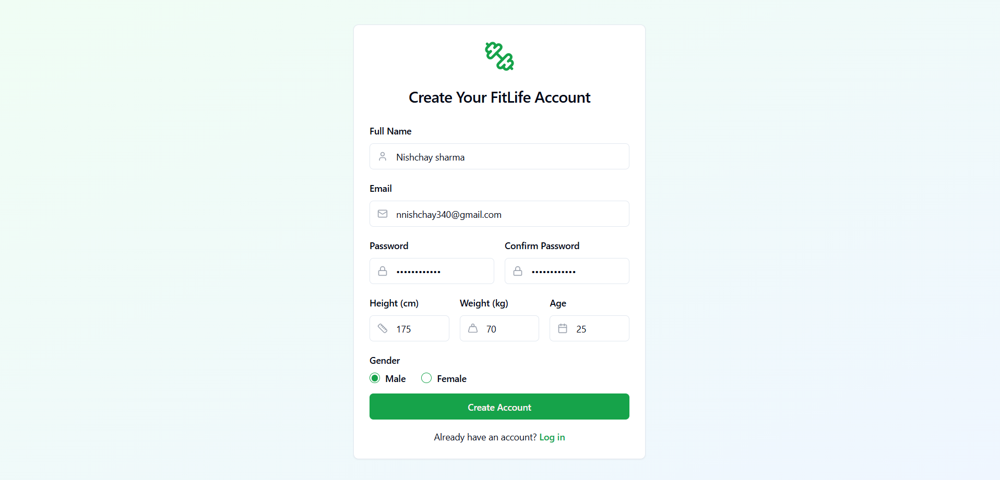
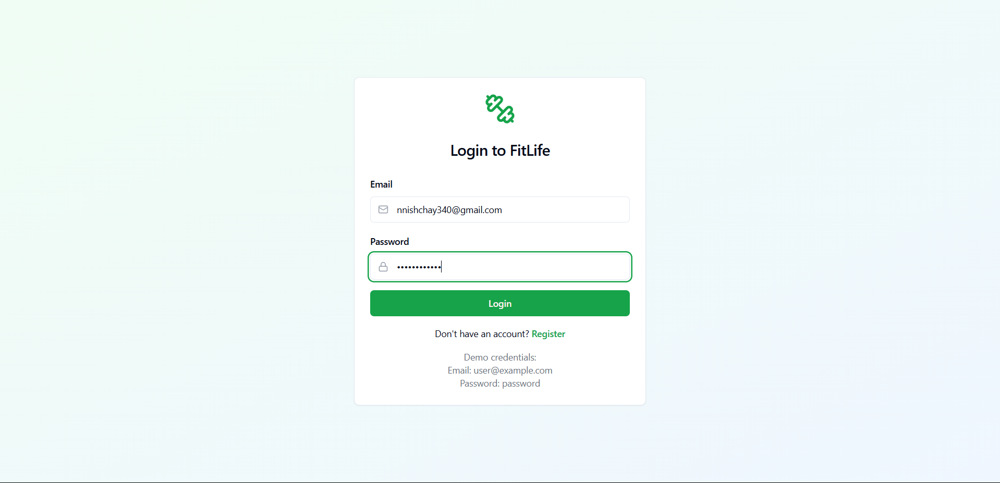
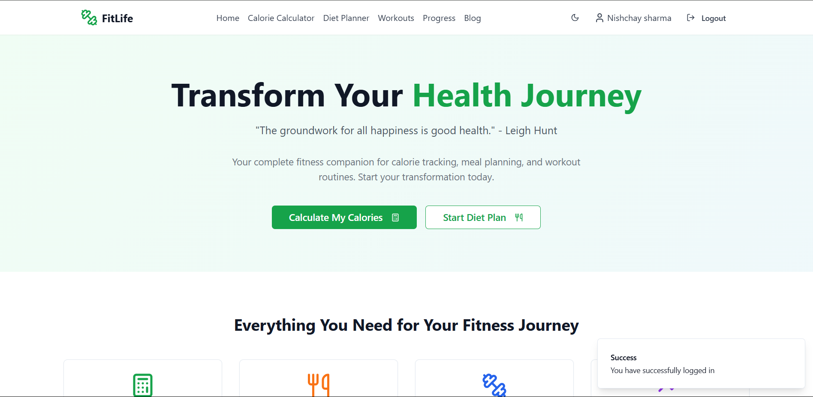
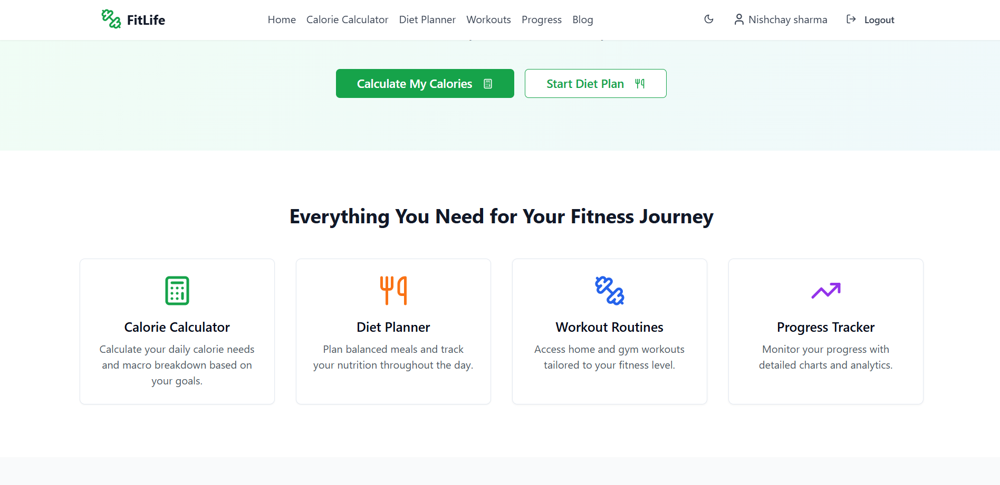
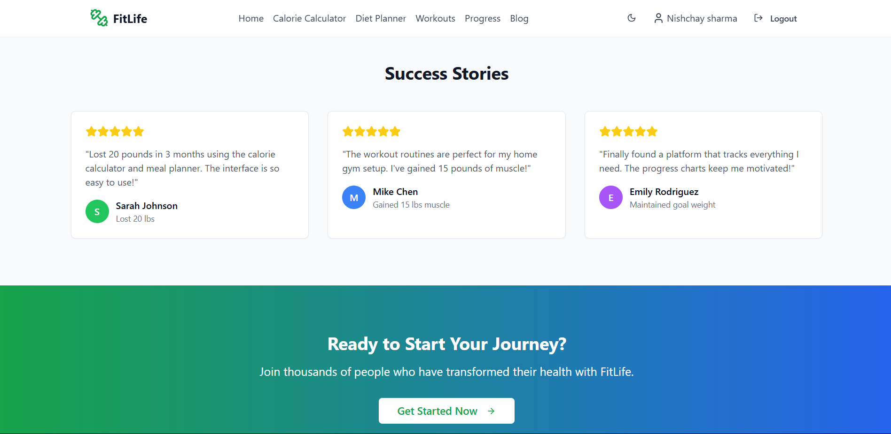
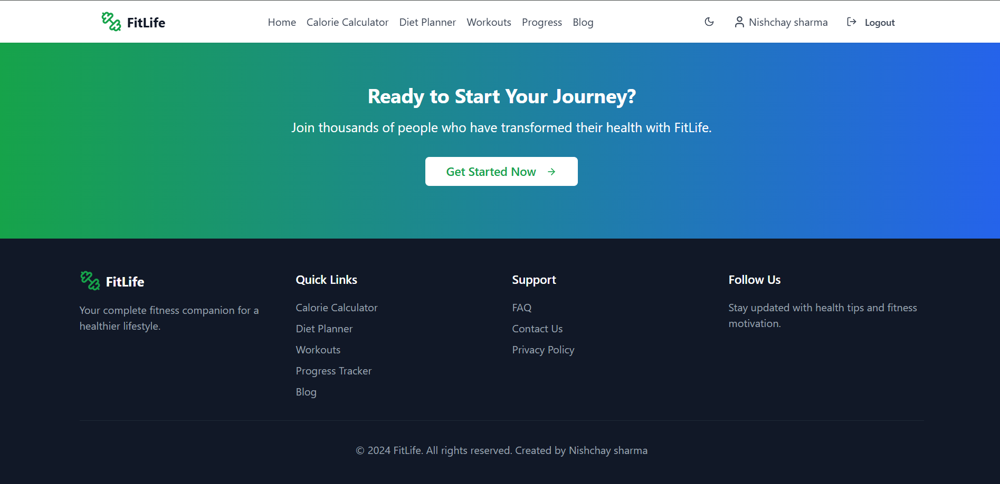
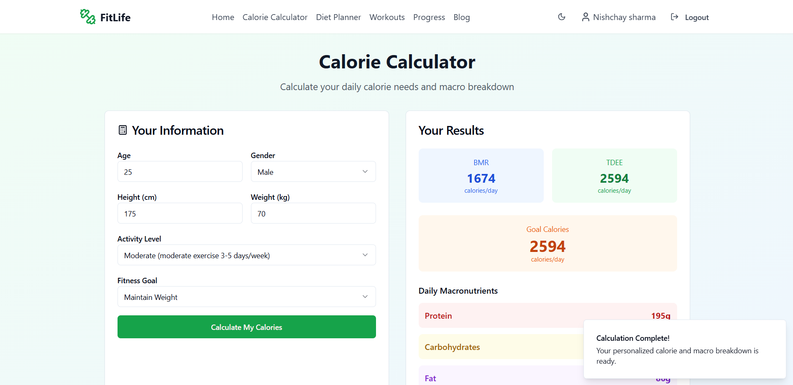
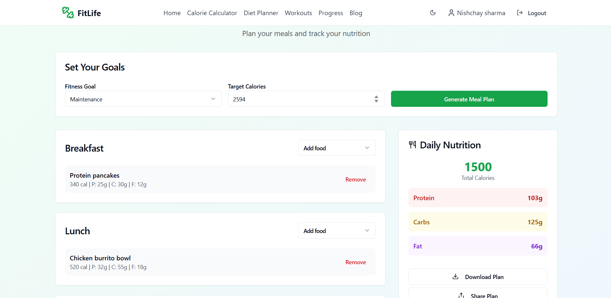
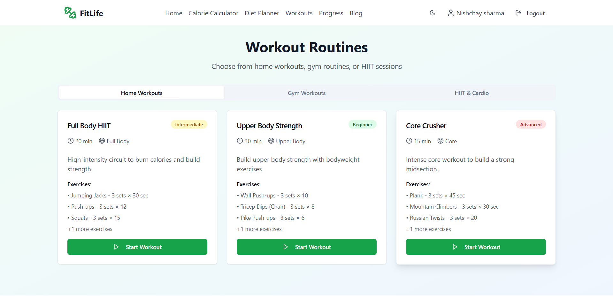
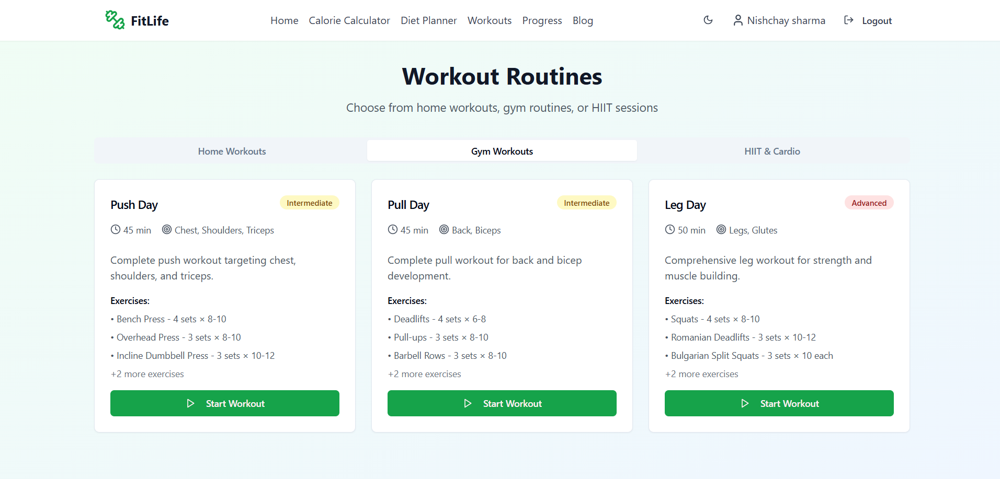

# FitLife - Fitness and Health Platform

A modern, responsive fitness and health platform designed to help users track their calorie needs, plan their diet, and follow workout routines for a healthier lifestyle.

## App Screenshots













## Features

- **Calorie Calculator**: Calculate daily energy needs based on personal metrics
- **Diet Planner**: Create and track balanced meal plans
- **Workout Routines**: Access home workouts, gym workouts, and HIIT routines
- **Progress Tracker**: Monitor weight, calories, and workout progress
- **Blog**: Health and fitness articles with expert advice
- **User Authentication**: Secure login and registration system
- **User Profile**: Personalized user settings and preferences

## Pages

1. **Home**: Overview of features with motivational content
2. **Calculator**: Form to calculate TDEE and macronutrient breakdown
3. **Diet Planner**: Meal planning tool with nutritional tracking
4. **Workouts**: Exercise routines categorized by type and difficulty
5. **Progress**: Charts and logs for monitoring fitness journey
6. **Blog**: Health and fitness articles and tips
7. **Blog Post**: Detailed article view
8. **Login/Register**: User authentication
9. **User Profile**: Account settings and preferences

## Tech Stack

- React 18+
- TypeScript
- React Router for navigation
- Tailwind CSS for styling
- Shadcn UI components
- Recharts for data visualization
- React Hook Form for form handling
- Redux for state management

## Getting Started

```bash
# Clone the repository
git clone <repository-url>

# Navigate to the project directory
cd fitlife

# Install dependencies
npm install

# Start the development server
npm run dev
```

## Project Structure

- `/src/components`: Reusable UI components
- `/src/pages`: Main application pages
- `/src/hooks`: Custom React hooks
- `/src/lib`: Utility functions and data

## Deployment

Build the application for production:

```bash
npm run build
```

The build output will be in the `dist` directory, ready to be deployed to your preferred hosting service.

## Responsive Design

FitLife is designed to work seamlessly across:
- Desktop computers
- Tablets
- Mobile phones

## Author

Nishchay Sharma

## License

MIT